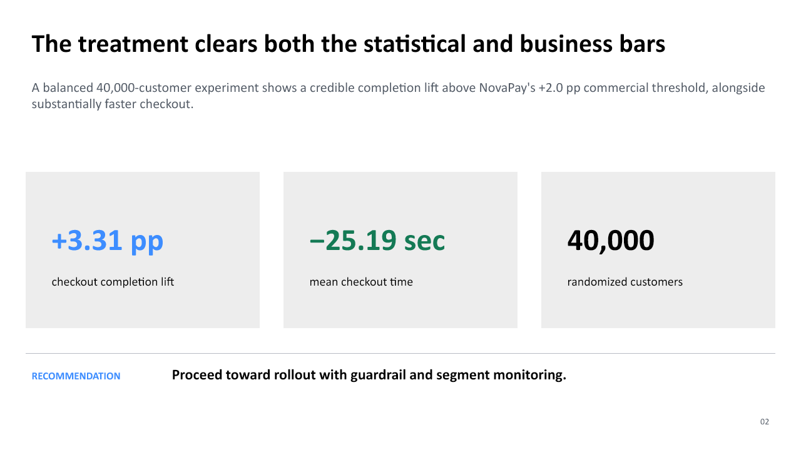

# NovaPay Simplified Checkout — Stakeholder Readout

> **Portfolio case study:** NovaPay, its customers, and every result below are
> fictional and synthetically generated.

[Download the five-slide PowerPoint readout](stakeholder_readout.pptx)

## Decision

Proceed toward rollout of the simplified checkout experience. Treatment improves
checkout completion beyond the predefined commercial threshold, materially
reduces checkout time, and does not show evidence of guardrail deterioration.

## Primary evidence

| Measure | Control | Treatment | Decision signal |
|---|---:|---:|---|
| Customers | 20,000 | 20,000 | Balanced 50/50 allocation |
| Checkout completion | 72.64% | 75.95% | **+3.31 pp** absolute lift |
| 95% confidence interval | — | — | **+2.45 to +4.17 pp** |
| Mean checkout time | 89.35 sec | 64.16 sec | **25.19 seconds faster** |

The completion effect is statistically distinguishable from zero (`p < 0.001`)
and exceeds NovaPay's predefined **+2.0 percentage-point** minimum business
effect. The confidence interval remains above that threshold at its lower bound.

## Experiment credibility

- Customer-level randomization produced 20,000 customers per group.
- The primary KPI and guardrails were defined before interpretation.
- The reference workflow validates assignment, duplicates, missingness, and
  binary outcome fields before inference.
- Absolute lift, relative lift, uncertainty, and practical significance are
  reported separately.

## Guardrails and trade-offs

| KPI | Control | Treatment | Interpretation |
|---|---:|---:|---|
| Support contact rate | 5.655% | 4.570% | Favorable and statistically detectable |
| Payment decline rate | 5.495% | 5.180% | Small favorable movement; inconclusive |
| Fraud rate | 0.355% | 0.350% | No meaningful difference detected |

Treatment was intentionally designed to perform more strongly on Mobile. That
segment pattern should be monitored after launch rather than treated as proof
that Desktop customers should be excluded.

## Recommendation and monitoring

1. Roll out through a controlled operational plan rather than an unmonitored switch.
2. Monitor completion, checkout time, payment declines, support contacts, and
   fraud during rollout.
3. Confirm the effect remains stable by device, country, and customer tenure.
4. Investigate any tracking or implementation changes before attributing
   post-launch movement to the experience.

## Limitations

These results validate an analytical workflow, not a real product decision. The
synthetic data encode a known treatment effect, and post-launch performance may
differ from the experiment if population, implementation, or measurement changes.

## Reproducibility

The values come from deterministic generation with `SEED = 42` and
`N_CUSTOMERS = 40_000`. See the [reference results](../case_study/expected_results.md),
[guided notebook](../notebooks/guided_ab_test_analysis.ipynb), and
[analysis code](../src/analyze_experiment.py).
