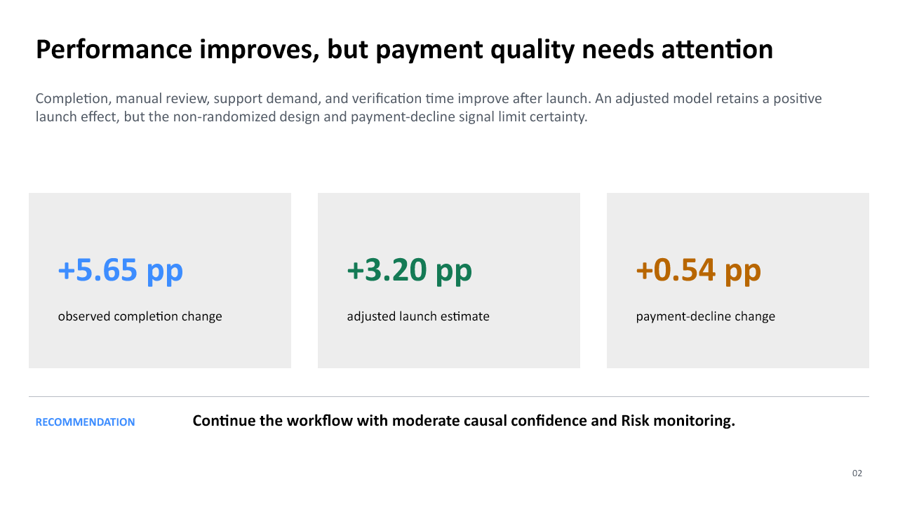

# FinFlow Automated Verification — Stakeholder Readout

> **Portfolio case study:** FinFlow, its transactions, and every result below are
> fictional and synthetically generated.

[Download the five-slide PowerPoint readout](stakeholder_readout.pptx)

## Decision

Continue the automated verification workflow with defined guardrail monitoring.
The direction and timing of the evidence support the workflow contributing to
improvement, but causal confidence is **moderate** because there is no randomized
Control group.

## Primary evidence

| Measure | Pre | Post | Decision signal |
|---|---:|---:|---|
| Transactions | 31,921 | 36,705 | 68,626 final analytical rows |
| Verification completion | 83.69% | 89.34% | **+5.65 pp** observed change |
| Stable-Post completion | 83.69% | 89.77% | **+6.08 pp** excluding ramp |
| Mean verification time | 112.85 sec | 78.28 sec | **34.57 seconds faster** |

The adjusted interrupted time-series model estimates an immediate level increase
of approximately **+3.20 percentage points** at launch (95% CI **+1.43 to
+4.97 pp**) after accounting for baseline trend, ramp, campaign timing, weekday
patterns, and traffic mix.

## Why causal confidence is moderate

Evidence supporting the intervention:

- the change aligns with the April 1 launch;
- stable-Post performance strengthens after the seven-day ramp;
- manual review and verification time improve in the expected direction; and
- the adjusted model retains a positive launch-level estimate.

Reasons for caution:

- the workflow launched to all eligible traffic, leaving no randomized Control;
- completion was already improving modestly before launch;
- device, tenure, country, and risk mix shift in Post; and
- a marketing campaign overlaps the Post period.

## Guardrails and trade-offs

| KPI | Pre | Post | Change | Interpretation |
|---|---:|---:|---:|---|
| Manual review | 31.50% | 22.23% | **−9.27 pp** | Strong mechanism evidence |
| Support contacts | 6.12% | 4.53% | **−1.59 pp** | Favorable movement |
| Payment declines | 7.52% | 8.06% | **+0.54 pp** | Adverse signal requiring monitoring |
| Fraud confirmed | 0.436% | 0.469% | +0.033 pp | Rare and statistically inconclusive |

The payment-decline increase should not be hidden by the favorable primary KPI.
Risk and Product should confirm whether the movement is operationally acceptable
and whether it persists outside the campaign and ramp periods.

## Recommendation and monitoring

1. Continue the workflow while reporting ramp and stable-Post separately.
2. Monitor payment declines, fraud event counts, support contacts, and completion.
3. Review high-risk traffic and campaign-period performance as distinct slices.
4. Use a phased rollout or holdout for the next material workflow change when feasible.

## Limitations

Interrupted time series improves on a two-bucket comparison but cannot eliminate
unmeasured concurrent changes. The estimated effect is association-adjusted
observational evidence, not randomized causal proof.

## Reproducibility

The results come from the deterministic synthetic generator and reference
workflow. See the [business case](../case_study/business_case.md),
[guided notebook](../notebooks/guided_pre_post_analysis.ipynb), and
[analysis code](../src/analyze_pre_post.py).
