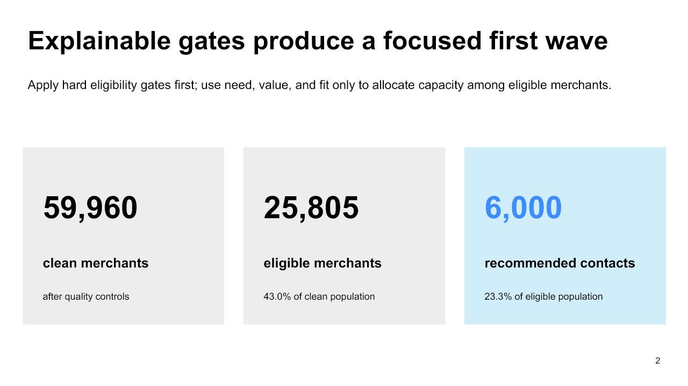

# LuminaPay Instant Settlement Target Recommendation

> **Decision:** Approve a controlled first wave of 6,000 eligible merchants, subject to policy sign-off, a fresh suppression pass, and a randomized measurement holdout.

[Download the five-slide PowerPoint readout](stakeholder_readout.pptx)

## Executive recommendation

Use the 2026-08-01 snapshot to contact all **2,573 High-priority merchants** plus the strongest **3,427 Medium-priority merchants**. The selected population passes every hard eligibility gate and fills the 6,000-contact capacity using visible need, value, and fit points.

Under deliberately illustrative assumptions, the wave produces about **806 expected adopters**, a **13.4% expected adoption rate**, and **$386.8K annualized contribution**. These are planning scenarios, not forecasts or measured impact.

## Population funnel

| Stage | Remaining | Share of clean population |
|---|---:|---:|
| Clean merchant population | 59,960 | 100.0% |
| Active account | 54,610 | 91.1% |
| Verified KYC | 49,163 | 82.0% |
| At least 3 months tenure | 49,032 | 81.8% |
| Not already enabled | 38,005 | 63.4% |
| No contact in prior 30 days | 34,174 | 57.0% |
| Low or medium risk | 30,678 | 51.2% |
| At least $5K monthly volume | 25,805 | 43.0% |

The largest reduction is merchants already using Instant Settlement. Keeping eligibility separate from priority makes every exclusion auditable and prevents capacity choices from changing policy.

## Capacity tradeoff

| Capacity | Expected adopters | Expected adoption | Annualized contribution | Average score |
|---:|---:|---:|---:|---:|
| 3,000 | 506 | 16.9% | $242.8K | 6.26 |
| **6,000** | **806** | **13.4%** | **$386.8K** | **5.54** |
| 9,000 | 1,106 | 12.3% | $530.8K | 5.03 |

The 6,000-contact option increases reach beyond the most concentrated 3,000 while avoiding the lower average priority and greater execution demand of 9,000. Scaling may still be attractive, but only after observed incremental impact replaces illustrative assumptions.

## Coverage and safeguards

- Country does not award score points. Selection rates range from 20.9% in the US to 29.5% in Brazil because the synthetically generated Brazil population has more settlement friction.
- Industry selection rates are closely grouped at 21.8%–23.6%; `Unknown` is 19.8% and should be monitored as a data-quality segment.
- High-risk, unverified, inactive, recently contacted, already enrolled, and low-volume merchants are excluded before scoring.
- The priority score is an auditable policy tool—not a probability, causal estimate, or entitlement.
- A production launch requires compliance and privacy review, minimum-data export, versioned rules, access controls, and a seven-day list expiry.

## Activation plan

1. Obtain Growth, Operations, Compliance, and Analytics approval for eligibility version 1.0 and scoring thresholds.
2. Reserve a randomized holdout within High and Medium priority bands.
3. Re-run enrollment, risk, KYC, account-status, and recent-contact suppressions immediately before send.
4. Export only merchant ID, as-of date, rule version, score components, tier, rank, and execution fields.
5. Reconcile selected, suppressed, delivered, contacted, and adopted counts after activation.

## Measurement and scale decision

Measure incremental adoption against the holdout, not only observed campaign response. Track delivery failures, complaints, opt-outs, operational exceptions, segment coverage, and realized contribution. Expand toward 9,000 only if incremental adoption is positive, operational capacity remains healthy, and guardrails are acceptable.

## Evidence boundary

The company, records, results, and economic assumptions are synthetically generated for portfolio demonstration. The scenario does not use employer, client, personal, or confidential data. Segment differences are descriptive, and the activation assumptions require experimental validation.
