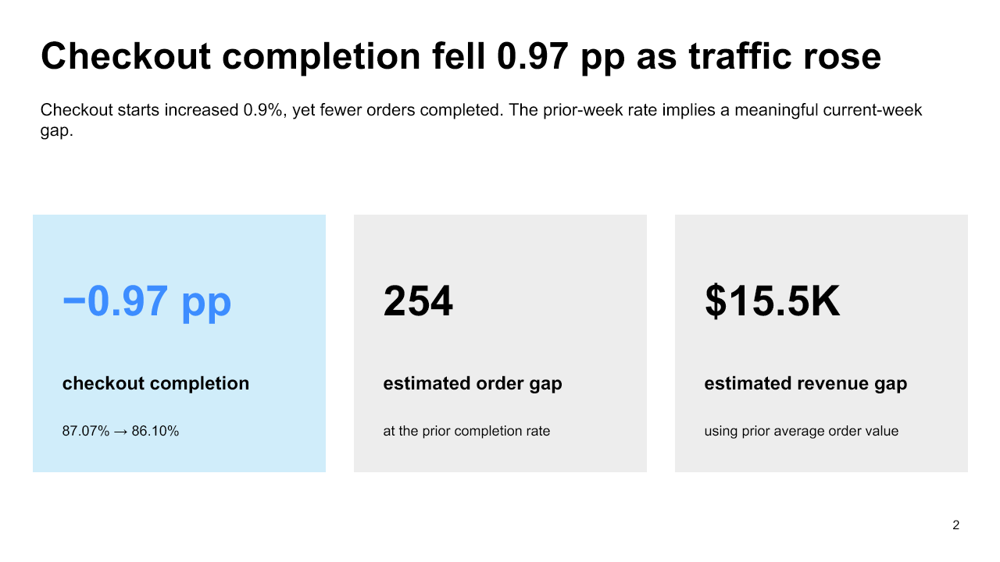

# OrbitMart Checkout Completion Diagnostic

> **Decision:** Pause further Android 8.4 expansion in Mexico and Brazil while Operations validates digital-wallet error signatures and applies a reversible mitigation.

[Download the five-slide PowerPoint readout](stakeholder_readout.pptx)

## Executive conclusion

Checkout completion declined from **87.07% to 86.10%**, a material **0.97 percentage-point decrease**, even as checkout starts increased 0.9%. At the prior-week rate, the current denominator would have produced about **254 additional orders**, worth an estimated **$15.5K** at the prior average order value.

Payment approval is the only KPI-tree stage with a comparable decline. The deterioration concentrates in **Android 8.4** and **Digital wallet** traffic, while traffic-mix effects are small. Checkout support contacts increased **47.2%**, providing an independent operational signal.

This evidence supports immediate mitigation, but it does not prove whether the Android release, wallet processor, or their interaction caused the decline.

## What changed

| Metric | Prior week | Current week | Change |
|---|---:|---:|---:|
| Checkout starts | 25,941 | 26,173 | +0.9% |
| Completed orders | 22,588 | 22,536 | −0.2% |
| Checkout completion | 87.07% | 86.10% | **−0.97 pp** |
| Revenue | $1.382M | $1.376M | −$6.0K observed |
| Checkout support contacts | 197 | 290 | **+47.2%** |

The matched periods contain the same weekdays and are complete. The movement exceeds the agreed 0.50 pp materiality threshold.

## KPI-tree diagnosis

| Stage | Prior | Current | Change | Interpretation |
|---|---:|---:|---:|---|
| Payment attempt | 96.31% | 96.26% | −0.05 pp | Stable |
| **Payment approval** | **91.55%** | **90.59%** | **−0.96 pp** | Primary diagnostic branch |
| Post-approval completion | 98.76% | 98.75% | −0.01 pp | Stable |

Attempt, approval, and post-approval rates multiply back to checkout completion in each period. This reconciliation rules out customer entry and post-approval order creation as meaningful first-order explanations.

## Where the decline concentrates

| Dimension | Segment | Prior | Current | Change | Within effect |
|---|---|---:|---:|---:|---:|
| Platform | Android | 86.64% | 84.28% | −2.35 pp | −0.86 pp |
| App version | Android 8.4 | 87.10% | 79.86% | **−7.24 pp** | **−1.04 pp** |
| Payment method | Digital wallet | 88.78% | 86.36% | **−2.41 pp** | **−0.80 pp** |
| Country | Mexico | 87.11% | 85.57% | −1.54 pp | −0.40 pp |

Android 8.4 and Digital wallet meet the pre-specified denominator, practical-materiality, and false-discovery-rate criteria. Mix effects are small, so the decline is not explained primarily by traffic composition.

## Evidence ladder

- **Facts:** checkout completion and payment approval declined materially; starts increased; support contacts rose.
- **Diagnostic evidence:** the largest within effects occur in Android 8.4 and Digital wallet segments.
- **Supported hypothesis:** an Android 8.4 wallet interaction is associated with the decline in Mexico and Brazil.
- **Stable branches:** attempt rate, post-approval completion, Android 8.3, and bank transfer do not show the same pattern.
- **Unknown:** release defects and processor issues remain causally entangled in aggregate data.

## Immediate action

1. Pause further Android 8.4 expansion in Mexico and Brazil.
2. Inspect request-level wallet errors, processor responses, and release telemetry.
3. If the error signature is confirmed, route wallet traffic or roll back the affected flow using the least disruptive reversible option.
4. Preserve Android 8.3 and non-wallet traffic as contemporaneous comparisons.
5. Monitor approval, completion, support contacts, and revenue hourly.

Resume expansion only after approval and completion recover for a sustained window and customer guardrails remain acceptable.

## Impact and limitations

The estimated 254-order and $15.5K gaps apply the prior completion rate and average order value to current traffic. They are planning counterfactuals, not measured causal loss. The aggregate grain cannot reveal request-level failure mechanisms, repeated attempts, or customer-level exposure.

The company, data, operational events, and monetary results are synthetically generated for portfolio demonstration. No employer, client, personal, or confidential data are used.
