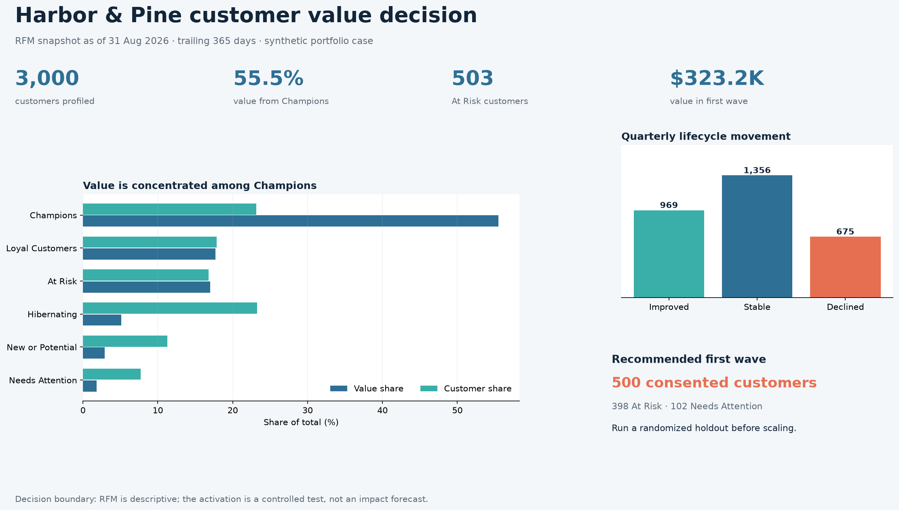

# Harbor & Pine Customer Value & Lifecycle Recommendation

> **Decision:** Approve a controlled first wave of 500 consented At Risk or Needs Attention customers, with a randomized holdout and explicit contact guardrails.

[Download the five-slide PowerPoint readout](stakeholder_readout.pptx)

## Executive recommendation

Use the 2026-08-31 RFM snapshot to protect high-value relationships and test a focused retention treatment. Champions are only **23.1% of customers but contribute 55.5% of trailing-year value**. Separately, **503 At Risk customers represent $377.0K**, creating a material but unproven retention opportunity.

Approve a first wave of **500 consented At Risk or Needs Attention customers** representing **$323.2K in trailing-year value**. Reserve a randomized holdout within comparable priority bands. Historical value determines where to test; only incremental repeat purchase and revenue should determine whether to scale.

## Customer value profile

| Segment | Customers | Customer share | Trailing-year value | Value share | Treatment intent |
|---|---:|---:|---:|---:|---|
| Champions | 694 | 23.1% | $1,232.7K | 55.5% | Protect experience; recognize loyalty; avoid discount overuse |
| Loyal Customers | 535 | 17.8% | $393.5K | 17.7% | Build frequency and cross-category engagement |
| At Risk | 503 | 16.8% | $377.0K | 17.0% | Test retention intervention with holdout |
| Hibernating | 698 | 23.3% | $113.3K | 5.1% | Use low-cost re-permission or suppress |
| New or Potential | 338 | 11.3% | $64.2K | 2.9% | Accelerate second purchase without heavy incentives |
| Needs Attention | 232 | 7.7% | $40.2K | 1.8% | Test value reminder and product discovery |

## Lifecycle movement

Between the 2026-05-31 and 2026-08-31 snapshots, **1,356 customers remain stable, 969 improve, and 675 decline**. The most important positive transition is 227 Loyal Customers becoming Champions. The main deterioration signals include 192 Loyal Customers moving to At Risk and 143 At Risk customers becoming Hibernating.

Migration is descriptive. Both customer behavior and relative quintile thresholds can change a segment, so these movements do not prove that a campaign or experience caused improvement or decline.

## First-wave design

The selected file contains **398 At Risk** and **102 Needs Attention** customers. Every selected customer has current marketing consent. Ranking uses an explicit blend of monetary score (45%), frequency score (35%), and disengagement evidence (20%), followed by a deterministic customer-ID tie-breaker.

Recommended treatments:

- At Risk: retention offer or service reminder, stratified by value band.
- Needs Attention: lower-cost product or benefit reminder.
- Randomized holdout: no campaign contact during the measurement window.
- Pre-send suppression: recheck consent, recent contact, delivery eligibility, and active incidents.

## Measurement and scale decision

Primary outcome: incremental repeat purchase within the agreed observation window. Secondary outcome: incremental recognized revenue net of offer cost. Guardrails: unsubscribe and complaint rates, delivery failure, contact frequency, operational exceptions, and country/channel coverage.

Scale only if the treatment produces positive incremental value, confidence intervals exclude a material downside, and guardrails remain acceptable. Raw response rate is insufficient because high-priority customers may have purchased without contact.

## Evidence boundary

The company, customers, transactions, results, and recommendations are synthetically generated for portfolio demonstration. RFM measures historical purchase behavior, not customer lifetime value, response probability, or causal impact. The analysis uses a fixed 365-day lookback and population-relative scoring; production thresholds require stability monitoring and business calibration.
