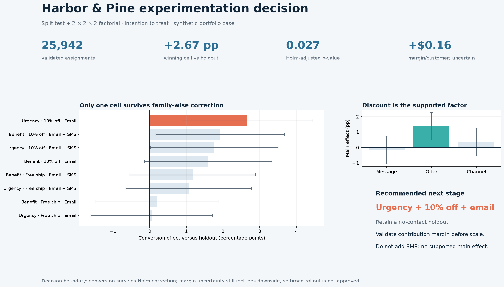

# Harbor & Pine Marketing Experimentation Recommendation

> **Decision:** Advance urgency-led messaging with a 10% discount through email only to a controlled margin-validation stage with a retained no-contact holdout. Do not approve broad rollout yet.

[Download the five-slide PowerPoint readout](stakeholder_readout.pptx)

## Executive recommendation

The urgency-led + 10% discount + email-only cell increases 14-day conversion by **2.67 percentage points** versus no-contact holdout, from **7.77% to 10.43%**. Its 95% confidence interval is **+0.88 to +4.45 pp**, and the result remains credible after Holm correction across eight cell comparisons (**adjusted p = 0.027**).

Advance this treatment to a fresh, controlled margin-validation stage. Keep a no-contact holdout, maintain the same intention-to-treat definition, and require a Finance-approved contribution-margin gate. The observed incremental margin is only **+$0.16 per assigned customer**, with a wide interval from **−$1.02 to +$1.33**. Conversion evidence is sufficient for another controlled stage, not for broad scale.

Do not add SMS. Email plus SMS has no supported pooled main effect, and additional contact pressure creates cost and customer-experience exposure without demonstrated incremental value.

## Validity and sensitivity

The deterministic validation gate reconciles **26,020 raw rows** to **25,942 valid assignments** and **78 quarantined records**. Quarantine covers duplicated assignments, invalid arms, missing lifecycle segments, consent violations, exposure or conversion before assignment, and incomplete 14-day windows.

Both assignment-count checks pass:

| Experiment | Valid assignments | SRM p-value | Integrity decision |
|---|---:|---:|---|
| Lifecycle-message split test | 7,989 | 0.955 | Pass |
| Factorial multivariate test | 17,953 | ~1.000 | Pass |

The split test can detect approximately **1.83 pp** with its validated sample, weaker than the original +1.50 pp planning target. The factorial design retains approximately **1.21 pp** pooled-main-effect sensitivity and **2.43 pp** cell-versus-holdout sensitivity under the declared assumptions.

## Split-test result

Lifecycle-informed messaging raises conversion from **8.27% to 9.71%**, an effect of **+1.44 pp** with a 95% confidence interval of **+0.19 to +2.69 pp** and `p = 0.024`.

The estimate is statistically credible but slightly below the predeclared **+1.50 pp practical threshold**. Revenue increases by an estimated **$1.63 per assigned customer**, while contribution margin increases by **$0.63**; both intervals include zero. Continue learning rather than treating this as a rollout mandate.

## Factorial learning

Holm correction across the three main effects and two prespecified interactions supports one pooled factor:

| Factor or interaction | Effect | 95% CI | Holm p-value | Decision signal |
|---|---:|---:|---:|---|
| 10% discount versus free shipping | **+1.37 pp** | +0.47 to +2.26 pp | **0.013** | Supported |
| Benefit-led versus urgency-led message | −0.17 pp | −1.06 to +0.72 pp | 1.000 | Not supported |
| Email plus SMS versus email only | +0.35 pp | −0.54 to +1.24 pp | 1.000 | Not supported |
| Message × offer | −0.58 pp | −2.37 to +1.20 pp | 1.000 | Not supported |
| Offer × channel | −1.28 pp | −3.06 to +0.50 pp | 0.638 | Not supported |

The discount is the only general factor with supported conversion evidence. The result does not establish that urgency framing is generally superior; urgency appears in the leading complete cell, while the pooled message effect is unresolved.

## Leading cell and economics

| Measure | Holdout | Leading cell | Effect or interpretation |
|---|---:|---:|---|
| 14-day conversion | 7.77% | 10.43% | +2.67 pp; Holm-adjusted p = 0.027 |
| Contribution margin/customer | $3.59 | $3.75 | +$0.16; 95% CI −$1.02 to +$1.33 |
| Unsubscribe | — | 0.45% | Below 1.50% threshold |
| Complaint | — | 0.05% | Below 0.50% threshold |
| Refund | — | 0.95% | Below 9.00% threshold |

The margin interval is the binding uncertainty. A discount can purchase conversions without generating enough incremental value, so the next experiment must be sized and monitored around margin—not simply repeat the conversion test.

## Controlled next-stage design

- Compare urgency + 10% discount + email only with no-contact holdout in a fresh eligible cohort.
- Revalidate email consent, suppression, recent purchase, and contact-frequency rules before assignment.
- Freeze product-cost, discount, refund, and revenue-recognition assumptions with Finance.
- Keep customer-level randomization and fixed 14-day conversion plus 30-day refund observation.
- Size the stage to improve margin precision and retain the current conversion and guardrail definitions.
- Review conversion, incremental margin, unsubscribe, complaint, and refund outcomes at the planned maturity date.
- Stop or roll back if a consent defect occurs, any critical guardrail crosses its threshold, or margin evidence indicates material downside.

## Evidence boundary

The company, customers, assignments, outcomes, costs, effect sizes, and recommendations are synthetically generated for portfolio demonstration. The analysis shows how to govern and interpret experiments; it does not predict real campaign performance. The factorial population is limited to customers consented for both email and SMS, even though the recommended treatment uses email only. Generalization to email-only customers requires new evidence.
